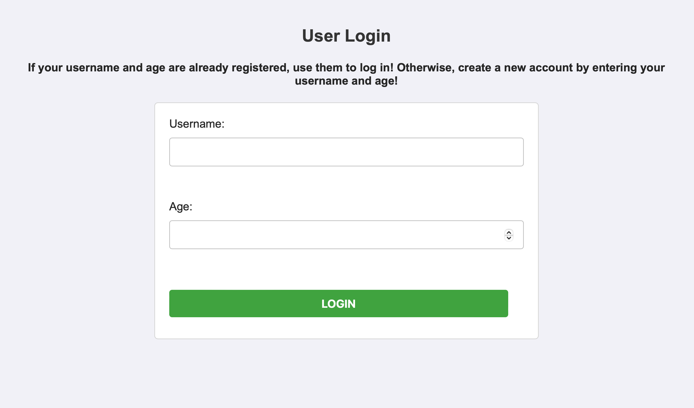

# Restaurant Rating Application (Tasty Ratings)

## Project Description

This project is a restaurant rating app designed to enhance customer engagement by allowing users to share their dining experiences. Users can post reviews, rate restaurants and dishes, and maintain personalized favorite lists. Restaurants can manage staff roles, update dish details, and post promotions to attract customers. 

The application models key aspects of the restaurant industry to address both customer and business needs:
- **User Interaction**: Users can create posts with text, ratings, and photos about restaurants and dishes. These posts serve as a review mechanism to help other customers. Users can also maintain Favorite Lists and redeem promotions.
- **Restaurant Operations**: Restaurants can manage employee roles (e.g., Waiters and Chefs), post promotions, and update dish details. Promotions offer users discounts on meals or dishes.

This application serves as a platform similar to Yelp or TripAdvisor, offering insights for customers and streamlining restaurant management for owners.

---

## Explore Our Interactive Interface

<p align="center">
  
  
</p>


---
## Features

- Post reviews, ratings, and photos for restaurants and dishes.
- Manage personalized favorite lists.
- Redeem restaurant promotions.
- Restaurants can:
  - Update dish details.
  - Post promotions.
  - Manage employee roles and responsibilities.
- Administrative functions such as database setup and reset.

---

## Technologies Used

- **Database**: Oracle SQL
- **Backend**: PHP
- **Frontend**: HTML, CSS, PHP
- **Development Tools**: PHP for backend scripting.

---

## Installation

### Prerequisites
- Oracle database setup (ensure credentials are configured).
- PHP installed locally.
- A web server such as Apache or Nginx.

### Steps to Install

1. **Clone the Repository**:
   ```bash
   git clone https://github.com/your_username/restaurant-rating-app.git
